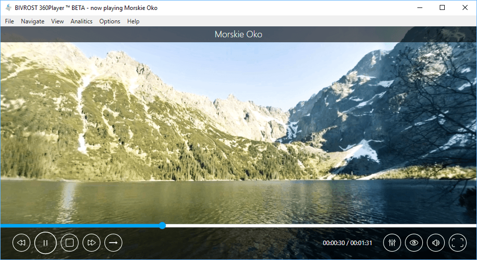
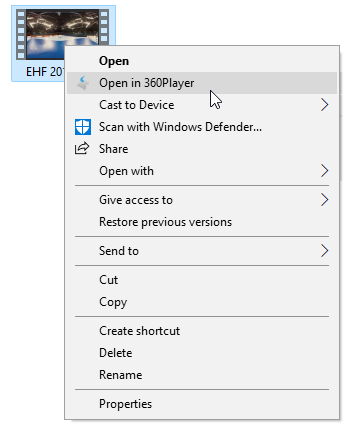

BIVROST 360Player for Windows
=============================

The easiest way to watch 360-videos using a VR headset!

The 360Player by BIVROST is a video player for immersive spherical videos. The desktop application for Windows lets you play virtual reality videos on your PC using a VR headset. It supports all versions of Oculus Rift, HTC Vive, OSVR and Windows Mixed Reality headsets.

Download the player to experience videos in smoothly way and high performance. Watch videos up to 4K and enjoy the finest resolution at 360 degrees.

Key features
------------

* 360 videos in up to 8K resolution
* 3D (stereoscopic) movie playback
* VR Headsets support
  * Oculus: Oculus Rift DK2, Oculus Rift CV1
  * OpenVR: HTC Vive
  * OSVR: OSVR HDK 1.4, OSVR HDK 2.0
  * Windows Mixed Reality (with SteamVR plugin)
* Hardware accelerated video decoding and rendering
* High performance, low latency playback
* Compatible with Windows 8.1 and 10

Requirements
------------

### Minimum requirements
* Dual Core CPU (dual core Intel Celeron N2xx or better)
* 1GB of RAM
* Intel HD 3000 graphic card or better with DX10 support
* 1366x768 screen resolution
* Windows 8.1
* Microsoft .NET 4.5

### Suggested configuration for 4K playback
* Dual Core 3rd generation i5 CPU or better
* 2GB of RAM
* DX11 compatible Nvidia/AMD discrete graphics (GCN for AMD or Kepler for Nvidia)
* 1920x1080 screen resolution
* Windows 10

Supported files and internet services
-------------------------------------
* Local and remote mp4 with H264 or H265/HEVC encoding.
* HLS streams
* Littlstar streams
* Pornhub streams

Using the player
================

To use 360Player for Windows open a file or an URL address from the internet using *File → Open File*, *File → Open URL* or the buttons at the center of the player when no movie is playing.

You can also drag and drop a movie on the player or right click on a movie and select "Open in 360Player".

Keyboard shortcuts
------------------

Available all the time:

* **Control + O**: open a file
* **Control + U**: open an URL from the internet
* **Control + Q**: quit 360Player
* **Control + ,**: settings
* **F1**: help
* **F11 or doubleclick movie**: toggle fullscreen
* **Escape**: exit fullscreen

Available only when movie is playing:

* **Control + S**: stop
* **Control + R**: rewind
* **Space or click movie**: play/pause
* **L**: enable little planet projection (only on equirectangular and dome)
* **N**: disable little planet projection
* **Control + T**: enable/disable user headset tracking (look in the direction the headset is looking)
* **Arrow keys or AWSD**: look around
* **+/- or mouse wheel**: zoom in and out
* **Control + 0**: reset zoom

Gamepad control
---------------

XBox or compatible gamepad is supported.

* **A**: play/pause
* **Y**: rewind
* **d-pad left/right**: seek backwards/forwards by 5 seconds
* **d-pad up/down**: volume up/down
* **analog left or right**: look around (both sticks works the same)

3dconnexion SpaceMouse/SpaceNavigator
-------------------------------------

The 3D mice made by 3dconnexion are also supported. 
[Official drivers for the device](http://www.3dconnexion.pl/service/drivers.html) must be installed.

* **Tilt up/down**: look up/down (this can be inverted in the settings)
* **Tilt left/right**: look left/right
* **Rotate clockwise/counter-clockwise**: look left/right

Enabled only when advanced control is enabled in settings:

* **Left button**: play/pause
* **Right button**: rewind
* **Push up/down**: zoom

Support & contact information
=============================

Contact support at: support@bivrost360.com.

This software is free and can be used only for noncommercial purposes. To purchase the commercial license contact us: contact@bivrost360.com.

### Why is the player crashing on Nvidia Optimus?
You need to run the player with Nvidia graphic card. See here for instruction. There are still some Optimus configurations that may not properly work. Feel free to write to support if you have one of them to help us make the player better.

### Oculus Rift doesn't work. Playback is only visible on Player window.
Oculus Rift is still under development. Check if you have newest version of Oculus PC Runtime. In some cases you need to reconnect Rift or restart your PC to make it work again. This problem considers not only the player but other applications connecting to Oculus Services.

### I'm getting "File not supported" trying to play video.
Bivrost Player supports playback of video files and codecs based on Microsoft Media Foundation. Popular file formats compatible with Player: mp4, avi, mov. Popular codecs: H.263, H.264, H.265/HEVC Windows Media Video. Matroska is not currently supported. Complete list is available on [MSDN][msdn-file-formats].  
 However, not all formats and resolutions are supported on all systems. It depends on your configuration and Windows version. The greatest variety is on Windows 10.

[msdn-file-formats]: https://msdn.microsoft.com/pl-pl/library/windows/desktop/dd757927(v=vs.85).aspx

### Do I need the Oculus Rift camera to be connected?
Positional tracker (camera) is not needed but is recommended. It helps re-position Oculus when playback is started to always look forward in VR. Without position tracking headset gyroscope may drift in time and make movies start looking at wrong direction.

### Is a VR headset required?
No. Headsets are supported but not required, You can watch movies using your computer's screen and look around with a mouse or another device.

### 360Player won't run on Windows N and Windows KN
You have to install Media Feature Pack for correct Windows version: Windows 8 ([KB2703761][KB2703761]), Windows 8.1 ([KB2929699][KB2929699]), Windows 10 ([KB3010081][KB3010081]) or Windows 10 1511 ([KB3099229][KB3099229]).

[KB2703761]: https://support.microsoft.com/en-us/kb/2703761
[KB2929699]: https://support.microsoft.com/en-us/kb/2929699
[KB3010081]: https://support.microsoft.com/en-us/kb/3010081
[KB3099229]: https://support.microsoft.com/en-us/kb/3099229

### Problems with installation? 
SmartScreen may prevent you from running the setup application. 
Press "run anyway". 

If you do not see the button, press "more info" first. 
It might also help to run the classical installer. 
Windows 8.1 or newer is required, will not work on XP, Vista, 7 or 8.

Changelog
=========

The BIVROST 360Player has been in development since 2015, the major improvements are listed in [the changelog](CHANGELOG.md).